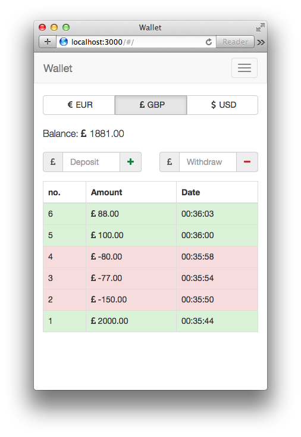

Wallet
===

<p align="center">
  
</p>

A quick proof of concept web wallet, built with Angular. Deployed at [http://vararu.org/wallet/](http://vararu.org/wallet/).

It's built on top of the [generator-gulp-angular](https://github.com/Swiip/generator-gulp-angular) seed app, and as such features all of those commands and doohickeys. In addition, I've added support for the `jade` HTML preprocessing language, and integrated it with the regular `gulp serve` task.

## Building locally

Make sure that you have `gulp` and `bower` installed, and then run `gulp serve` from the project root:

```bash
$ git clone https://github.com/tvararu/wallet.git
$ cd wallet
$ npm install
$ gulp serve
```

To run the unit tests:

```bash
$ gulp test
```

To run the end to end tests:

```bash
$ gulp protractor
```

To actually build it for shipping:

```bash
$ gulp
```

## License

[MIT](license.txt).
